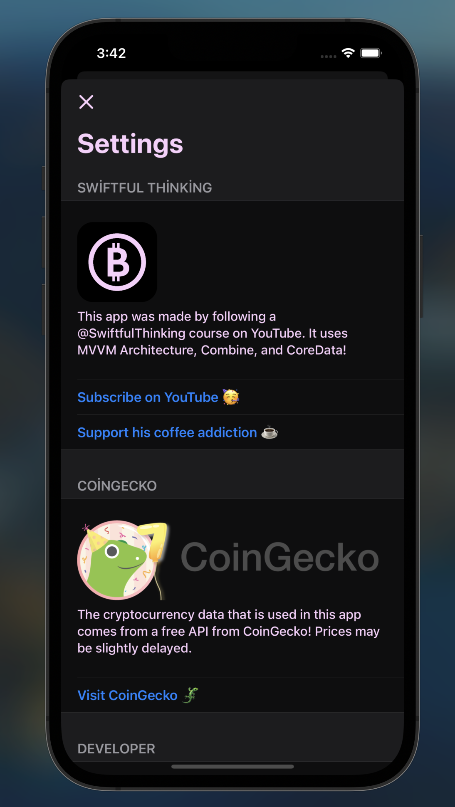
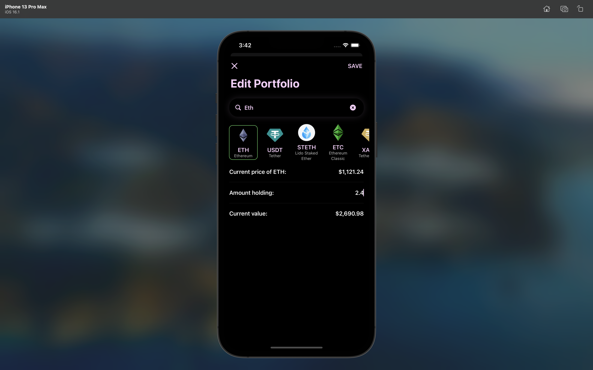
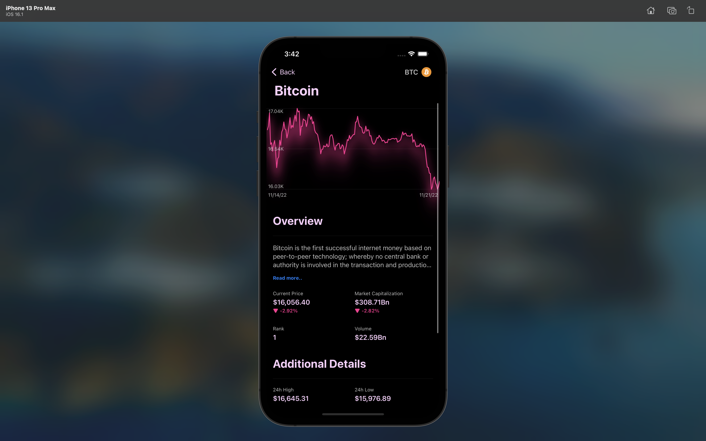

#  CRYPTO

SwiftUI ile %100 programmatic olarak geliştirildi MVVM architecture Full Native, extra library kullanılmadı UrlSessions ile veriler kullanıldı FileManager ile verilerin tekrar terkar indirilmesi engellenip ram şişmesi önlendi HapticManager kullanıldı Extensionslar ile kod kalabalığının önüne geçildi CoreData kullanarak protfolio ya alınan coinler uygulama kapandıktan sonrada tutuldu ChartView ile animasyon oluşturularak güzel bir grafik gösterimi sağlandı

HOMEPAGE:
* 

SETTINGS:
* 

PORTFOLİO:
* 

PAY COİN:
* 

COİN DETAİL:
* 

